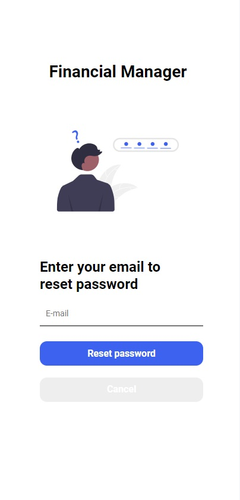

# Estrutura do React Auth

> Está é uma aplicação simples de Login, com a estrutura de Auth do React, para fins de estudo e lembrete


```sh
yarn install
```

## Execut

```sh
yarn dev
```

## Pagina de Login


## Informações da Tela

1 - Utilizar os seguintes dados "e-mail: bruno@teste.com.br / password: 123";
2 - O mesmo ao logar irá salvar os dados do token no localStorage do navegador

## Página de Registro


1 - Utilizar qualquer dado, pois não está integrado com a API;
2 - Ao enviar os dados vão ser mostrados no console do navegador;

## Página de Esqueci a Senha



1 - Página de exemplo para reset password

